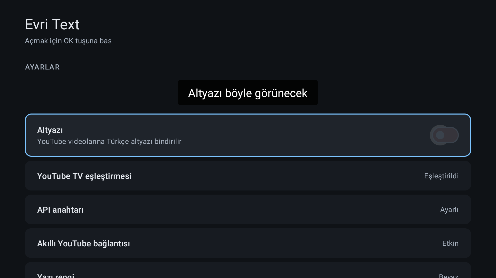
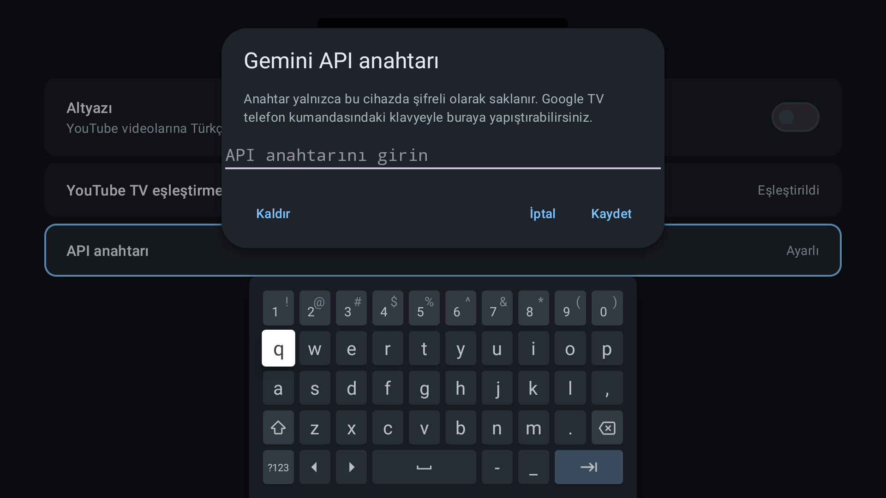
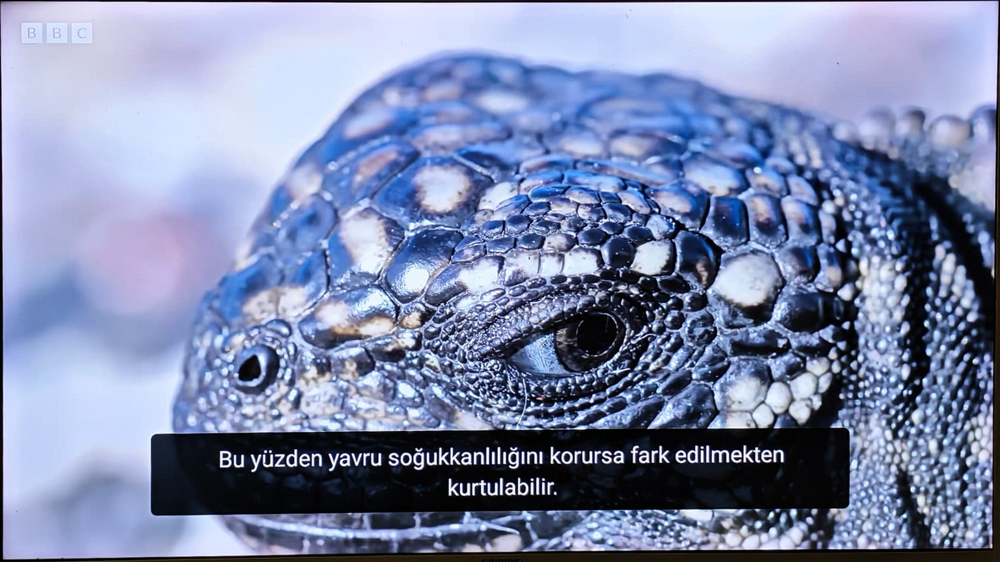

<p align="center">
  
</p>

<p align="center">
  <a href="README.md">Türkçe</a> · <strong>English</strong>
</p>

# Evri Text

An open-source companion app that adds AI-powered Turkish subtitles to videos
playing in the official YouTube app on Android TV.

Evri Text does not modify the video or replace YouTube with a separate player. It
tracks the video playing in YouTube, translates an available caption track into
Turkish with Gemini, and displays the result in sync through an on-screen overlay.

> [!IMPORTANT]
> This project is under active development. Evri Text is not developed, supported,
> or endorsed by Google, YouTube, or Gemini.

## Screenshots

<p align="center">
  
  
</p>

<p align="center"><sub>Settings and secure API key entry with the TV keyboard</sub></p>

<p align="center">
  
</p>

<p align="center"><sub>Turkish subtitles generated by Evri Text for an English-language <a href="https://www.youtube.com/watch?v=7ZhdXgRfxHI">BBC Earth video</a></sub></p>

## Features

- Works alongside the official YouTube for Android TV app.
- Automatically detects the source language and can translate available YouTube
  captions from languages including English, French, and Arabic into Turkish.
- Prioritizes the currently watched section and displays completed chunks without
  waiting for the whole video.
- Handles video changes, seeking, pausing, ads, Shorts, and end-of-video states.
- Lets you adjust subtitle size, color, background, and screen position with the TV
  remote.
- Follows the TV system language; Turkish is the default and English is supported.
- Stores the API key only on the device and in encrypted form.
- Uses no proprietary server, user account, ads, or analytics.

## Requirements

- Android TV or Google TV — Android 9 / API 28 or later
- The official YouTube app
- Your own [Gemini API key](https://aistudio.google.com/apikey)
- Permission to display over other apps
- Notification access if smart YouTube connection tracking is enabled

## Installation and usage

1. Install the Evri Text APK on your TV and open the app.
2. In YouTube, go to **Settings → Link with TV code** and generate a code.
3. Enter the code in the pairing field in Evri Text.
4. Add your Gemini API key. You can use the Google TV mobile remote keyboard to
   enter long keys more easily.
5. Grant permission to display over other apps.
6. Optionally enable notification access for **Smart YouTube connection**.
7. Turn on Evri Text subtitles and play a video in YouTube.

Evri Text does not read notification contents. It uses notification access only to
detect whether YouTube has an active media session and to manage its connection
correctly when switching between apps.

## How it works

1. A YouTube Lounge session provides the current video ID and playback position.
2. NewPipeExtractor discovers the video's available caption tracks.
3. Captions are converted into readable sentences and translated into Turkish with
   Gemini.
4. Translated sentences are displayed at the correct time in an Android overlay
   window.

See [DESIGN.md](DESIGN.md) for technical decisions and [TODO.md](TODO.md) for planned
work.

## Building from source

Open the repository root in Android Studio, or run this with Java 17 installed:

```powershell
.\gradlew.bat assembleDebug
```

Generated APK: `app/build/outputs/apk/debug/app-debug.apk`

Run unit tests with:

```powershell
.\gradlew.bat testDebugUnitTest
```

For optional tests that call the real Gemini API, copy `.env.example` to `.env` and
add your own key. Never commit your API key.

### Signed release

Create your permanent release key outside the repository. Copy
`keystore.properties.example` to `keystore.properties`, then enter the real file
path, alias, and passwords. The real properties file and all `*.jks` keys are ignored
by Git.

```powershell
.\gradlew.bat assembleRelease
.\gradlew.bat bundleRelease
```

Back up the key and passwords securely. You will need the same signing identity to
publish future updates to the application.

## Localization

The app uses Android's resource system. `app/src/main/res/values/strings.xml` contains
the default Turkish strings, while `values-en/strings.xml` contains the English
translation. Another UI language can be added with a resource file such as
`values-fr/strings.xml`.

The interface language and subtitle target language are independent. The current
release translates subtitles into Turkish.

## Privacy and limitations

The data flow and external services are documented in [PRIVACY.md](PRIVACY.md).
Evri Text relies on unofficial YouTube endpoints and NewPipeExtractor; YouTube
changes may temporarily break the app. A video must have an accessible caption track
to be translated.

## Contributing

Bug reports and pull requests are welcome. Add a relevant unit test for behavioral
changes and, when possible, verify the result on a real Android TV or Google TV
device. Never submit API keys, pairing data, or personal device logs.

The application ID is `tr.com.uslanozan.evritext`. Debug builds are installed as
`tr.com.uslanozan.evritext.debug`.

## License

Evri Text is distributed under the [GNU General Public License v3.0 or later](LICENSE).
Third-party components remain subject to their own licenses. NewPipeExtractor, used
for caption extraction, is also licensed under GPL-3.0-or-later.

See [third-party notices](THIRD_PARTY_NOTICES.md), the [trademark policy](TRADEMARKS.md),
and [security policy](SECURITY.md) for more information.
